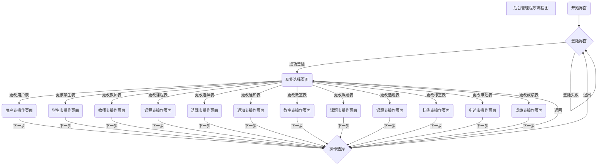

```mermaid
graph TB
  F[后台管理程序流程图]
	start(开始界面) --> login{登陆界面}
    login -->  |成功登陆|choose(功能选择页面)
    login --> |登陆失败|login
    choose --> |更改用户表|user(用户表操作页面)
    user --> |下一步| next{操作选择}
    choose --> |更该学生表|student(学生表操作页面)
    student --> |下一步| next
    choose --> |更改教师表|teacher(教师表操作页面)
    teacher --> |下一步| next
    choose --> |更改课程表|course(课程表操作页面)
    course --> |下一步| next
    choose --> |更改选课表|cCourse(选课表操作页面)
    cCourse --> |下一步| next
    choose --> |更改通知表|notice(通知表操作页面)
    notice --> |下一步| next
    choose --> |更改教室表|room(教室表操作页面)
    room --> |下一步| next
    choose --> |更改课题表|subject(课题表操作页面)
    subject --> |下一步| next
    choose --> |更改选题表|cSubject(课题表操作页面)
    cSubject --> |下一步| next
    choose --> |更改标签表|label(标签表操作页面)
    label --> |下一步| next
    choose --> |更改申述表|complaint(申述表操作页面)
    complaint --> |下一步| next
    choose --> |更改成绩表|score(成绩表操作页面)
    score --> |下一步| next
    next --> |返回| choose
    next --> |退出| login
  
```